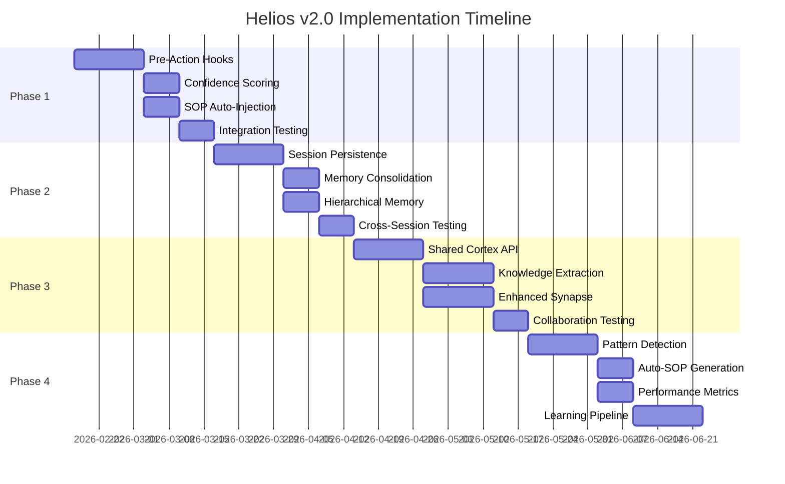

# Helios Ecosystem Improvement Plan v2.0

**Author:** Nova (Strategic Planning Agent)  
**Date:** 2026-02-17  
**Target:** Cortex v2.0, Synapse v2.0, Helios Architecture v3.0

## Executive Summary

This plan transforms Helios from a brilliant-but-inconsistent system into a structurally enforced, continuously learning AI architecture. The core insight: **voluntary discipline fails at scale**. We need mandatory knowledge integration, not optional memory lookup.

### Current State Assessment

- ✅ **Knowledge Storage**: Cortex STM, embeddings, atoms, 14 comprehensive SOPs
- ✅ **Inter-Agent Messaging**: Synapse with full threading/priority support
- ❌ **Knowledge Usage**: Stored but not consulted before action
- ❌ **Session Persistence**: "Will you remember in 2 days?" = No
- ❌ **Structural Enforcement**: Everything relies on voluntary discipline
- ❌ **Sub-Agent Integration**: Isolated execution without shared learning

## Phase 1: Structural Enforcement Engine (4-6 weeks)

_Make knowledge lookup mandatory, not optional_

### 1.1 Pre-Action Hook System

**Goal**: Intercept ALL tool calls and force knowledge consultation before execution.

**Implementation**:

```typescript
// ~/Projects/helios/extensions/cortex/hooks/pre-action.ts
export class PreActionHook {
  async beforeToolCall(toolName: string, params: any, context: SessionContext) {
    // Step 1: Extract context keywords from tool call
    const keywords = this.extractContext(toolName, params);

    // Step 2: MANDATORY SOP lookup
    const relevantSOPs = await this.findRelevantSOPs(keywords, context.workingDir);

    // Step 3: MANDATORY cortex "process" category search
    const processMemories = await cortex.search({
      category: "process",
      query: keywords.join(" "),
      minConfidence: 0.3,
    });

    // Step 4: Inject into context (not optional)
    if (relevantSOPs.length > 0 || processMemories.length > 0) {
      context.mandatoryKnowledge = {
        sops: relevantSOPs,
        memories: processMemories,
        injectedAt: Date.now(),
      };

      // BLOCK execution until knowledge is acknowledged
      await this.enforceKnowledgeReview(context);
    }
  }

  private extractContext(toolName: string, params: any): string[] {
    const contextMap = {
      exec: [params.workdir, params.command?.split(" ")[0]],
      browser: [params.targetUrl?.hostname],
      nodes: [params.node, params.command?.[0]],
      message: [params.target, params.channel],
    };

    return contextMap[toolName] || [toolName];
  }
}
```

**Enforcement Mechanism**:

- Tool calls are **queued**, not executed immediately
- Agent MUST acknowledge injected knowledge before execution proceeds
- Failed knowledge review = tool call rejected
- Tracking: log all knowledge injections and acknowledgments

### 1.2 Confidence Scoring System ✅ COMPLETED (2026-02-17)

**Goal**: Rate memory reliability to prevent acting on stale/wrong information.
**Status**: Deployed in Cortex v1.2.0 (cortex-v1.2.0)
**Migration**: `python3 migrate_confidence.py --progress`

**Memory Confidence Factors**:

```yaml
confidence_algorithm:
  base_score: 1.0 # Perfect confidence at creation

  decay_factors:
    age_days: -0.01 per day # 2% weekly decay
    access_frequency: +0.05 per access in 30 days
    contradiction_penalty: -0.3 per conflicting memory
    validation_bonus: +0.2 per successful execution

  minimum_threshold:
    critical_operations: 0.8 # Infrastructure, money, security
    routine_operations: 0.5 # Documentation, status checks
    experimental: 0.2 # New procedures, untested
```

**Implementation**:

```typescript
interface MemoryWithConfidence {
  id: string;
  content: string;
  confidence: number;
  last_validated: Date;
  validation_count: number;
  contradiction_flags: string[];
}

class ConfidenceEngine {
  calculateCurrentConfidence(memory: Memory): number {
    const daysSinceCreated = (Date.now() - memory.created) / (1000 * 60 * 60 * 24);
    const ageDecay = Math.max(0.1, 1.0 - daysSinceCreated * 0.01);

    const accessBonus = Math.min(0.5, memory.access_count * 0.05);
    const contradictionPenalty = memory.contradiction_flags.length * 0.3;
    const validationBonus = memory.validation_count * 0.2;

    return Math.max(
      0.1,
      Math.min(1.0, ageDecay + accessBonus - contradictionPenalty + validationBonus),
    );
  }
}
```

### 1.3 SOP Auto-Injection System

**Goal**: Make preflight checks and gotchas unavoidable.

**Context Detection**:

```typescript
class SOPDetector {
  async detectRelevantSOPs(toolCall: ToolCall, workingDir: string): Promise<SOP[]> {
    const patterns = [
      // Direct project detection
      {
        pattern: /\/Projects\/([^\/]+)/,
        sopPath: (match) => `~/Projects/${match[1]}/${match[1]}.ai.sop`,
      },

      // Host-based detection
      {
        pattern: /ssh\s+(\w+)/,
        sopPath: () => "~/Projects/helios/extensions/cortex/sop/fleet.ai.sop",
      },

      // Service detection
      { pattern: /comfyui|flux|8188/, sopPath: () => "~/Projects/ComfyUI/comfyui.ai.sop" },
      {
        pattern: /ft-?991a|hamlib|rigctl/,
        sopPath: () => "~/Projects/lbf-ham-radio/ft991a.ai.sop",
      },
      {
        pattern: /augur|trading|paper_augur/,
        sopPath: () => "~/Projects/augur-trading/augur.ai.sop",
      },
    ];

    for (const { pattern, sopPath } of patterns) {
      if (pattern.test(JSON.stringify(toolCall))) {
        return await this.loadSOP(sopPath(pattern.exec(JSON.stringify(toolCall))));
      }
    }

    return [];
  }
}
```

**Deliverables**:

- [ ] Pre-action hook system integrated with OpenClaw tool pipeline
- [ ] Confidence scoring for all memories (retroactive scoring of existing)
- [ ] SOP auto-injection with context detection
- [ ] Knowledge acknowledgment UI/CLI flow
- [x] Comprehensive logging of all knowledge interactions ✅ **COMPLETED** (v1.3.0 - Metrics Instrumentation)

---

## Phase 2: Cross-Session Persistence Engine (3-4 weeks)

_Make "will you remember in 2 days?" = YES_

### 2.1 Session State Preservation

**Goal**: Maintain context across session boundaries with confidence decay.

**Session Context Schema**:

```typescript
interface SessionState {
  session_id: string;
  start_time: Date;
  end_time?: Date;

  // Active context that should persist
  working_memory: WorkingMemoryItem[];
  hot_topics: string[]; // Currently relevant keywords
  active_projects: string[]; // Projects being worked on
  pending_tasks: Task[]; // Unfinished work

  // Knowledge state
  recent_learnings: Memory[]; // New insights from this session
  confidence_updates: ConfidenceUpdate[]; // Memory validations/contradictions
  sop_interactions: SOPInteraction[]; // Which SOPs were used/ignored

  // Cross-session links
  previous_session: string;
  continued_by: string;
}
```

**Session Continuation Algorithm**:

```typescript
class SessionContinuity {
  async initializeSession(userId: string): Promise<SessionContext> {
    const recentSessions = await this.getRecentSessions(userId, 7); // 7 days lookback
    const contextScore = this.calculateContextRelevance(recentSessions);

    return {
      inherited_context: this.selectRelevantContext(recentSessions, contextScore),
      confidence_adjusted_memories: await this.adjustMemoryConfidence(recentSessions),
      automatic_sop_suggestions: await this.suggestRelevantSOPs(recentSessions),
    };
  }

  private calculateContextRelevance(sessions: SessionState[]): Map<string, number> {
    // Recent sessions get higher weight
    // Repeated topics get boosted
    // Unfinished tasks get maximum weight
  }
}
```

### 2.2 Memory Consolidation System

**Goal**: Merge redundant memories, promote important patterns, archive noise.

**Consolidation Pipeline**:

```typescript
interface ConsolidationRule {
  name: string;
  trigger: "daily" | "weekly" | "on_similarity" | "on_contradiction";
  min_age_hours: number;
  action: "merge" | "promote" | "archive" | "flag_contradiction";
  conditions: {
    similarity_threshold?: number;
    access_count_threshold?: number;
    category_constraints?: string[];
  };
}

const CONSOLIDATION_RULES: ConsolidationRule[] = [
  {
    name: "merge_near_duplicates",
    trigger: "daily",
    min_age_hours: 24,
    action: "merge",
    conditions: { similarity_threshold: 0.95 },
  },
  {
    name: "promote_validated_procedures",
    trigger: "weekly",
    min_age_hours: 168,
    action: "promote",
    conditions: { access_count_threshold: 5, category_constraints: ["process"] },
  },
  {
    name: "flag_contradictory_instructions",
    trigger: "on_contradiction",
    min_age_hours: 1,
    action: "flag_contradiction",
    conditions: { similarity_threshold: 0.7 },
  },
];
```

**Auto-Archive Algorithm**:

```typescript
class MemoryArchival {
  async evaluateForArchival(memory: Memory): Promise<ArchivalDecision> {
    const factors = {
      age: this.getAgeFactor(memory.created),
      access_frequency: memory.access_count / memory.age_in_days,
      confidence: await this.getConfidenceScore(memory),
      category_importance: this.getCategoryWeight(memory.categories),
      contradiction_count: memory.contradiction_flags.length,
    };

    const archival_score = this.calculateArchivalScore(factors);

    if (archival_score > 0.8) {
      return { action: "archive", reason: "low_utility", confidence: archival_score };
    } else if (factors.contradiction_count > 2) {
      return { action: "quarantine", reason: "unreliable", confidence: 1.0 };
    }

    return { action: "keep", confidence: 1.0 - archival_score };
  }
}
```

### 2.3 Long-Term Memory Architecture

**Goal**: Hierarchical memory with automatic promotion/demotion based on usage patterns.

**Memory Tiers**:

```
Tier 1: Working Memory (always loaded, max 10 items)
├─ Current session context
├─ Pinned critical procedures
└─ Active project state

Tier 2: Hot Memory (loaded on relevance, max 100 items)
├─ Recently accessed (7 days)
├─ High-confidence procedures
└─ Current project knowledge

Tier 3: Warm Memory (searched on demand, unlimited)
├─ Historical context
├─ Archived procedures
└─ Low-confidence memories

Tier 4: Cold Storage (compressed, searchable)
├─ Old contradicted memories
├─ Superseded procedures
└─ Raw session logs
```

**Deliverables**:

- [ ] Session state preservation across restarts
- [ ] Memory consolidation pipeline with configurable rules
- [ ] Hierarchical memory tier system with auto-promotion/demotion
- [ ] Cross-session context scoring and inheritance
- [ ] Memory archival system with contradiction detection

---

## Phase 3: Collaborative Intelligence Engine (5-6 weeks)

_Transform sub-agents from isolated workers to collaborative learners_

### 3.1 Shared Cortex Architecture

**Goal**: Sub-agents access parent cortex for knowledge AND contribute learnings back.

**Sub-Agent Cortex Access Pattern**:

```typescript
interface SubAgentCortexAPI {
  // Read access to parent knowledge
  inheritKnowledge(parent_session: string, task_context: string[]): Promise<InheritedKnowledge>;

  // Confidence-aware memory access
  queryWithConfidence(query: string, min_confidence: number): Promise<MemoryWithConfidence[]>;

  // Learning contribution back to parent
  contributeKnowledge(learning: Memory, validation_context: TaskResult): Promise<void>;

  // Real-time knowledge sync
  subscribeToRelevantUpdates(categories: string[]): EventStream<MemoryUpdate>;
}

class ParentChildCortex {
  async spawnWithSharedKnowledge(task: Task, parent_context: SessionContext): Promise<SubAgent> {
    // 1. Analyze task to determine relevant knowledge categories
    const relevantCategories = await this.categorizeTask(task);

    // 2. Pre-load high-confidence memories for those categories
    const inheritedKnowledge = await cortex.search({
      categories: relevantCategories,
      min_confidence: 0.6,
      limit: 50,
    });

    // 3. Create sub-agent with knowledge context
    const subAgent = await this.createSubAgent({
      task,
      inherited_knowledge: inheritedKnowledge,
      parent_session: parent_context.session_id,
      knowledge_sync_categories: relevantCategories,
    });

    return subAgent;
  }
}
```

### 3.2 Knowledge Extraction from Task Results

**Goal**: Automatically capture learnings from successful task completions.

**Task Result Analysis**:

```typescript
interface TaskLearning {
  task_type: string;
  success_factors: string[]; // What made it work
  failure_points: string[]; // What almost went wrong
  novel_procedures: Procedure[]; // New ways of doing things
  validated_assumptions: string[]; // Confirmed existing knowledge
  contradicted_assumptions: string[]; // Knowledge that was wrong
}

class LearningExtractor {
  async extractLearnings(task_result: TaskResult): Promise<TaskLearning> {
    // Analyze tool call sequences for novel patterns
    const novel_patterns = await this.findNovelPatterns(task_result.tool_calls);

    // Compare against existing SOPs to find deviations
    const sop_deviations = await this.compareToProcedures(task_result, task_result.relevant_sops);

    // Identify knowledge that was validated by successful execution
    const validated_knowledge = await this.findValidatedKnowledge(task_result.inherited_knowledge);

    return {
      task_type: task_result.task.type,
      success_factors: this.identifySuccessFactors(task_result),
      failure_points: this.identifyNearFailures(task_result.execution_log),
      novel_procedures: novel_patterns.filter((p) => p.success_rate > 0.8),
      validated_assumptions: validated_knowledge.map((k) => k.content),
      contradicted_assumptions: sop_deviations.filter((d) => d.resulted_in_error),
    };
  }
}
```

### 3.3 Synapse Enhancement for Rich Coordination

**Goal**: Upgrade Synapse from simple messaging to collaborative intelligence platform.

**Enhanced Message Types**:

```typescript
interface SynapseMessage {
  // Existing fields
  id: string;
  from: string;
  to: string;
  subject: string;
  body: string;
  priority: "info" | "action" | "urgent";
  thread_id?: string;

  // New collaboration fields
  message_type: "status" | "question" | "knowledge_share" | "task_handoff" | "learning_report";
  knowledge_attachments?: Memory[]; // Share relevant memories
  confidence_scores?: Map<string, number>; // How confident is this info
  validation_request?: ValidationRequest; // Ask for knowledge verification
  task_context?: TaskContext; // What task is this related to
}

interface KnowledgeShareMessage extends SynapseMessage {
  message_type: "knowledge_share";
  learnings: {
    validated_procedures: Procedure[];
    contradicted_assumptions: string[];
    novel_insights: Memory[];
    confidence_updates: ConfidenceUpdate[];
  };
}
```

**Collaborative Workflows**:

```typescript
class CollaborativeWorkflow {
  // Sub-agent asks parent for guidance on ambiguous situation
  async requestGuidance(
    sub_agent: string,
    situation: string,
    options: string[],
  ): Promise<Guidance> {
    const message = await synapse.send({
      to: "main",
      message_type: "question",
      subject: `Guidance needed: ${situation}`,
      body: `Context: ${situation}\n\nOptions:\n${options.map((o, i) => `${i + 1}. ${o}`).join("\n")}`,
      priority: "action",
      validation_request: {
        type: "decision_support",
        context: situation,
        options: options,
      },
    });

    return await this.waitForGuidanceResponse(message.thread_id);
  }

  // Parent validates sub-agent learnings before accepting
  async validateLearning(learning: Memory, reporter: string): Promise<ValidationResult> {
    // Check against existing knowledge for contradictions
    const similar_memories = await cortex.search({
      query: learning.content,
      threshold: 0.7,
      exclude_source: reporter,
    });

    if (similar_memories.some((m) => this.isContradictory(m, learning))) {
      return {
        accepted: false,
        reason: "contradicts_existing_knowledge",
        conflicting_memories: similar_memories.filter((m) => this.isContradictory(m, learning)),
      };
    }

    return { accepted: true, confidence: this.assessLearningConfidence(learning) };
  }
}
```

**Deliverables**:

- [ ] Shared cortex access for sub-agents with inheritance patterns
- [ ] Automatic knowledge extraction from task completions
- [ ] Enhanced Synapse with knowledge-sharing message types
- [ ] Collaborative validation workflows for new learnings
- [ ] Sub-agent knowledge contribution and conflict resolution

---

## Phase 4: Self-Improvement Loops (4-5 weeks)

_Detect patterns, auto-generate procedures, continuously evolve_

### 4.1 Failure Pattern Detection

**Goal**: Automatically identify when the same mistakes happen repeatedly.

**Pattern Recognition Engine**:

```typescript
interface FailurePattern {
  pattern_id: string;
  description: string;
  frequency: number;
  first_seen: Date;
  last_seen: Date;
  contexts: string[]; // Where does this pattern occur
  severity: "low" | "medium" | "high" | "critical";

  // Pattern definition
  trigger_conditions: string[]; // What circumstances lead to this
  failure_modes: string[]; // How it manifests
  current_knowledge_gaps: string[]; // What SOPs/memories are missing

  // Auto-fix potential
  automatable: boolean;
  suggested_sop: SOPTemplate;
}

class FailurePatternDetector {
  async detectPatterns(lookback_days: number = 30): Promise<FailurePattern[]> {
    // Get all task failures in timeframe
    const failures = await this.getTaskFailures(lookback_days);

    // Cluster failures by similarity
    const failure_clusters = await this.clusterFailures(failures);

    // Identify recurring patterns
    const patterns = failure_clusters
      .filter((cluster) => cluster.size >= 3) // At least 3 occurrences
      .map((cluster) => this.analyzeFailurePattern(cluster));

    return patterns.filter((p) => p.severity !== "low");
  }

  private async analyzeFailurePattern(cluster: FailureCluster): Promise<FailurePattern> {
    // Find common elements across failures
    const common_contexts = this.findCommonContexts(cluster.failures);
    const common_commands = this.findCommonCommands(cluster.failures);
    const missing_knowledge = await this.identifyKnowledgeGaps(cluster.failures);

    return {
      pattern_id: this.generatePatternId(cluster),
      description: this.generateDescription(common_contexts, common_commands),
      frequency: cluster.size,
      contexts: common_contexts,
      severity: this.assessSeverity(cluster),
      trigger_conditions: this.extractTriggerConditions(cluster),
      current_knowledge_gaps: missing_knowledge,
      automatable: this.assessAutomationPotential(cluster),
      suggested_sop: await this.generateSOPTemplate(cluster),
    };
  }
}
```

### 4.2 Auto-SOP Generation

**Goal**: Generate new .ai.sop files from repeated successful patterns.

**SOP Template Generation**:

```typescript
class AutoSOPGenerator {
  async generateSOPFromPattern(success_pattern: SuccessPattern): Promise<SOPTemplate> {
    const successful_executions = await this.getSuccessfulExecutions(success_pattern);

    // Extract common preflight steps
    const preflight_steps = this.extractPreflightSteps(successful_executions);

    // Extract canonical commands
    const commands = this.extractCanonicalCommands(successful_executions);

    // Extract gotchas from near-failures
    const gotchas = await this.extractGotchasFromNearFailures(success_pattern.context);

    return {
      meta: {
        name: success_pattern.name,
        auto_generated: true,
        confidence: success_pattern.success_rate,
        based_on_executions: successful_executions.length,
      },
      preflight: preflight_steps,
      commands: commands,
      gotchas: gotchas,
      validation_needed: this.requiresHumanValidation(success_pattern),
    };
  }

  async proposeSOPCreation(pattern: SuccessPattern): Promise<SOPProposal> {
    const template = await this.generateSOPFromPattern(pattern);

    // Send proposal through Synapse
    await synapse.send({
      to: "main",
      message_type: "knowledge_share",
      subject: `Auto-SOP Proposal: ${template.meta.name}`,
      body: this.formatSOPProposal(template, pattern),
      priority: template.validation_needed ? "action" : "info",
      knowledge_attachments: [this.createSOPMemory(template)],
    });

    return { template, requires_approval: template.validation_needed };
  }
}
```

### 4.3 Performance Feedback Loops

**Goal**: Track what's working and automatically optimize.

**Performance Metrics**:

```typescript
interface PerformanceMetrics {
  // Effectiveness metrics
  sop_adherence_rate: number; // % of times SOPs were followed
  knowledge_lookup_rate: number; // % of times knowledge was consulted
  first_attempt_success_rate: number; // % tasks completed without retries

  // Efficiency metrics
  avg_task_completion_time: number;
  knowledge_lookup_overhead: number; // Time spent on knowledge lookup
  context_switching_cost: number; // Time lost to irrelevant knowledge

  // Learning metrics
  new_knowledge_creation_rate: number; // Learnings per day
  knowledge_validation_accuracy: number; // % of learnings that prove correct
  memory_confidence_trend: number; // Are memories getting more/less reliable

  // Quality metrics
  contradiction_detection_rate: number; // How often we catch conflicting info
  procedure_optimization_rate: number; // How often we improve existing SOPs
}

class PerformanceFeedbackEngine {
  async generateOptimizationRecommendations(): Promise<OptimizationPlan> {
    const metrics = await this.calculateCurrentMetrics();
    const baseline = await this.getHistoricalBaseline();
    const trends = this.calculateTrends(metrics, baseline);

    const recommendations = [];

    if (trends.sop_adherence_rate < -0.1) {
      recommendations.push({
        issue: "SOP adherence declining",
        root_cause: await this.analyzeSOPNonCompliance(),
        recommendation: "Strengthen pre-action hooks or simplify SOPs",
        priority: "high",
      });
    }

    if (trends.knowledge_lookup_overhead > 0.2) {
      recommendations.push({
        issue: "Knowledge lookup becoming too slow",
        root_cause: "Too many low-relevance matches",
        recommendation: "Improve search relevance ranking or implement caching",
        priority: "medium",
      });
    }

    return { recommendations, metrics, trends };
  }
}
```

### 4.4 Continuous Learning Architecture

**Goal**: The system gets better over time without manual intervention.

**Learning Pipeline**:

```typescript
class ContinuousLearner {
  async runLearningCycle(): Promise<LearningCycleResult> {
    // Phase 1: Detect patterns
    const failure_patterns = await this.detectFailurePatterns();
    const success_patterns = await this.detectSuccessPatterns();

    // Phase 2: Generate improvements
    const sop_proposals = await this.generateSOPProposals(success_patterns);
    const knowledge_updates = await this.generateKnowledgeUpdates(failure_patterns);

    // Phase 3: Validate improvements
    const validated_changes = await this.validateProposedChanges([
      ...sop_proposals,
      ...knowledge_updates,
    ]);

    // Phase 4: Apply approved changes
    const applied_changes = await this.applyValidatedChanges(validated_changes);

    // Phase 5: Track results
    await this.scheduleEffectivenessTracking(applied_changes);

    return {
      patterns_detected: failure_patterns.length + success_patterns.length,
      improvements_proposed: sop_proposals.length + knowledge_updates.length,
      changes_applied: applied_changes.length,
      next_cycle: this.calculateNextCycleTime(),
    };
  }

  // Weekly learning cycle
  @Cron("0 0 * * 0") // Every Sunday at midnight
  async weeklyLearningCycle() {
    const result = await this.runLearningCycle();

    await synapse.send({
      to: "main",
      subject: `Weekly Learning Report: ${result.changes_applied} improvements applied`,
      body: this.formatLearningReport(result),
      priority: "info",
    });
  }
}
```

**Deliverables**:

- [ ] Failure pattern detection with clustering algorithms
- [ ] Auto-SOP generation from successful execution patterns
- [ ] Performance metrics tracking and trend analysis
- [ ] Continuous learning pipeline with validation workflows
- [ ] Weekly learning cycle automation

---

## Phase 5: Game-Changer Features (6-8 weeks)

_Capabilities that put Helios ahead of what model providers ship_

### 5.1 Predictive Intent — Act Before Asked (task-005)

**Goal**: Synthesize calendar, repos, trading systems, and user patterns to anticipate needs and deliver timed insights before being asked.

**Key Capabilities**:

- Context fusion across all data sources (AUGUR signals, calendar, git activity, fleet health, print jobs)
- Temporal awareness: deliver insights when they're actionable, not just when they exist
- Priority scoring: distinguish "nice to know" from "act now"
- Proactive briefings: morning context, pre-meeting prep, anomaly alerts
- Learn which predictions Matthew acts on → reinforce those patterns

### 5.2 Self-Healing Infrastructure (task-006)

**Goal**: Monitor → detect anomaly → attempt fix → escalate only if fix fails. Turn every incident into a runbook, then automate the runbook.

**Key Capabilities**:

- Service health monitoring (AUGUR executor, signal-cli, pipeline agents, fleet services)
- Anomaly detection: phantom positions, zombie processes, stale signals, disk/memory pressure
- Automated remediation: restart services, clear stale state, rotate logs
- Incident-to-runbook pipeline: every manual fix becomes an automated response
- Escalation tiers: auto-fix → Synapse alert → Signal notification to Matthew

### 5.3 Adversarial Self-Testing (task-007)

**Goal**: Chaos engineering for AI systems. Actively try to break what we build before production does.

**Key Capabilities**:

- Spawn adversarial agents that inject bad data into memory, simulate crashes, feed contradictory SOPs
- Fuzz testing for pre-action hooks: can they be bypassed?
- Memory corruption tests: what happens when confidence scores are wrong?
- Pipeline stress tests: what breaks under concurrent stage execution?
- Generate failure reports that feed directly into the self-improvement loop

### 5.4 Knowledge Compression — Abstraction Engine (task-008)

**Goal**: Continuously compress observations into principles. 50 data points → 3 insights.

**Key Capabilities**:

- Automatic clustering of related memories across categories
- Principle extraction: find the common thread across specific observations
- Hierarchical abstraction: facts → patterns → principles → axioms
- Compression metrics: track ratio of raw observations to derived principles
- Integration with atoms system: link compressed knowledge to source observations

### 5.5 Cross-Domain Pattern Transfer (task-009)

**Goal**: Find structural similarities across completely different domains (trading, radio, fleet, infrastructure).

**Key Capabilities**:

- Mathematical structure matching: same pattern shape in different data
- Metaphor engine: "VWAP divergence in trading" ≈ "signal fade in ham radio" ≈ "resource contention in fleet"
- Cross-pollination alerts: "Pattern X that works in domain A might apply to domain B"
- Domain-agnostic feature extraction from domain-specific data
- Novel hypothesis generation from cross-domain connections

### 5.6 Earned Autonomy — Progressive Trust (task-010)

**Goal**: Build a quantified track record. Small decisions made well → earn the right to make bigger ones without asking.

**Key Capabilities**:

- Decision tracking: log every autonomous decision and its outcome
- Trust scoring: success rate by decision category and risk level
- Auto-approve tiers: tier 1 (read-only) → tier 2 (non-destructive) → tier 3 (infrastructure changes) → tier 4 (financial)
- Promotion/demotion: good track record raises tier, mistakes lower it
- Transparency: Matthew can see the full decision log and trust scores at any time

### 5.7 Real-Time Learning from Failure — Instant Propagation (task-011)

**Goal**: One mistake should make the entire system permanently better in under 60 seconds.

**Key Capabilities**:

- Failure detection: catch the mistake as it happens (error, correction from Matthew, SOP violation)
- Instant propagation chain: rewrite SOP → update pre-action hook patterns → adjust confidence scores → add regression test
- Cross-system updates: a failure in AUGUR should update fleet SOPs if the root cause is infrastructure
- Failure-to-fix pipeline: mistake → root cause → SOP patch → test → deploy (all automated)
- Metrics: time-to-propagation, propagation completeness, recurrence rate

---

## Implementation Timeline



## Success Metrics

### Phase 1 Success Criteria

- [ ] **100% knowledge injection**: Every infrastructure tool call gets relevant SOP/memory injection
- [ ] **95% acknowledgment rate**: Agents acknowledge injected knowledge before proceeding
- [ ] **Confidence scoring accuracy**: 90% of high-confidence memories prove correct when validated
- [ ] **Zero critical failures**: No infrastructure operations that ignore relevant SOPs

### Phase 2 Success Criteria

- [ ] **Cross-session continuity**: "Will you remember in 2 days?" = YES with >80% accuracy
- [ ] **Memory consolidation**: <5% duplicate memories, >90% of merged memories are semantically identical
- [ ] **Context inheritance**: New sessions inherit 90% of relevant context from recent sessions
- [ ] **Memory tier performance**: Working memory <100ms access, Hot memory <500ms, Warm memory <2s

### Phase 3 Success Criteria

- [ ] **Sub-agent knowledge sharing**: 100% of sub-agents have access to parent cortex
- [ ] **Learning contribution**: >70% of successful task completions contribute new knowledge
- [ ] **Validation accuracy**: <10% false positive rate on contradictory knowledge detection
- [ ] **Collaborative efficiency**: Sub-agents complete tasks 30% faster with shared knowledge

### Phase 4 Success Criteria

- [ ] **Pattern detection**: Identify >80% of recurring failure patterns with <20% false positives
- [ ] **Auto-SOP accuracy**: Generated SOPs have >90% success rate when followed
- [ ] **Continuous improvement**: System performance metrics improve >5% quarter-over-quarter
- [ ] **Self-optimization**: >50% of identified improvement opportunities are automatically implemented

## Risk Mitigation

### Technical Risks

1. **Performance degradation** from mandatory knowledge lookup
   - _Mitigation_: Implement aggressive caching, optimize search algorithms, parallel processing
2. **Context explosion** as memory grows large
   - _Mitigation_: Hierarchical memory tiers, automatic archival, relevance scoring
3. **Knowledge conflicts** between human and auto-generated content
   - _Mitigation_: Confidence scoring, human validation gates, conflict resolution workflows

### Operational Risks

1. **Over-enforcement** making the system too rigid
   - _Mitigation_: Configurable enforcement levels, override mechanisms, gradual rollout
2. **Knowledge quality degradation** from automated generation
   - _Mitigation_: Validation requirements, human review processes, quality metrics
3. **System complexity** becoming unmaintainable
   - _Mitigation_: Modular architecture, comprehensive testing, clear documentation

## Conclusion

This improvement plan transforms Helios from a system that stores knowledge to one that **enforces knowledge usage**. The key insight is replacing voluntary discipline with structural enforcement through pre-action hooks, confidence scoring, and mandatory knowledge injection.

The phased approach ensures each capability builds on the previous one:

- Phase 1 creates the enforcement foundation
- Phase 2 adds persistence and continuity
- Phase 3 enables collaborative intelligence
- Phase 4 closes the loop with continuous learning

Success means Matthew can confidently answer "YES" to "Will you remember this in 2 days?" and trust that Helios will consistently apply accumulated knowledge rather than repeating past mistakes.

**Expected Outcome**: A self-improving AI system that learns from every interaction, shares knowledge across all agents, and gets more reliable over time through structural enforcement rather than hoping for voluntary compliance.
